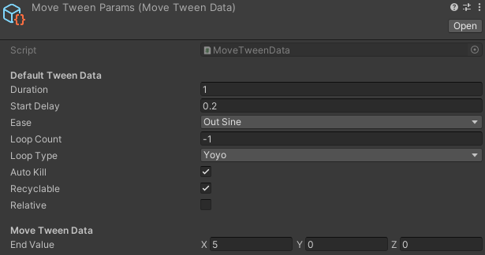

# DOTween-Data-Wrapper

## Table Of Contents 
 
<details>
<summary>Details</summary>

  - [Introduction](#introduction)
  - [Normal DOTween Usage](#normal-dotween-usage)
  - [DOTween Data Wrapper Usage](#ddw-dotween-usage) 
  - [Components](#components)
    - [Transform](#transform)
    
</details>

## Introduction
A component-based DOTween data wrapper (DDW), built specifically to make life easier for developers. It's still under development. 

    
## Normal DOTween Usage
    
```csharp
    using UnityEngine;
    using DG.Tweening;
 
    public class DOTweenGenericWay : MonoBehaviour
    {
        private Tween tween;

        private void Start()
        {
            tween = transform.DOMoveX(5f, 1f)
                .SetDelay(.2f)
                .SetEase(Ease.OutSine)
                .SetAutoKill(true)
                .SetRecyclable(true)
                .Play();
        }
    }
```
 The example above shows how to do tweening using one of the DOTween's functions. Although, DOTween is a great tweening library. I believe I can make it much more 
 easier for the developers.
 
 ## DDW DOTween Usage
 
   #### Recommended Way
 
 ```csharp
    using UnityEngine;
    using DG.Tweening;
 
    public class DDWSolution : MonoBehaviour
    {
        public BaseTweenData baseTweenData;

        private Tween tween;

        private void Start()
        {
            tween = baseTweenData.GetTween(gameObject).Play();
        }
    }
```
 - With the DDW (DOTween Data Wrapper), you don't need to know your tween type (MoveTween, RotateTween, ScaleTween, etc.). You just need a "BaseTweenData" object to get the data you need in order to do tweening. At this moment, you migth ask a question "How in the earth would it know what tween type I want it to tween?". It is simple indeed. 
You tell it how to tween in the editor like below.



Note the following
 - In order to use GetTween function, you need to pass in a gameObject. There is also a way where you don't need to pass in any argument.

## DDW Other DOTween Usage

   #### Not Recommended Way

 ```csharp
    using UnityEngine;
    using DG.Tweening;
    
    public class TestCubeController : BaseTestController
    {
        public MoveTweenData tweenData;

        private Tween tween;

        private void Start()
        {
            tween = transform.DOMove(tweenData.EndValue, tweenData.Duration)
                .SetDelay(.2f)
                .SetEase(Ease.OutSine)
                .SetAutoKill(true)
                .SetRecyclable(true)
                .Play();
        }
}
```
If you don't feel confident with the gameObject you have to pass in, you might want to use DDW as shown above. Note that, In order to use DDW like that, you need a
"XXXTwenData" object (in this case, it's MoveTweenData) not a BaseTweenData. You also make sure that you will not change the Tween Data in the editor with a different
TweenData anymore such as ScaleTweenData,RotateTweenData, etc.


## Components
Supports the following components.
- Transform

### Transform
1 - Move Tween
  - DOMove
  - DOMoveX/DOMoveY/DOMoveZ
  - DOLocalMoveX/DOLocalMoveY/DOLocalMoveZ

2 -  Rotate Tween
   - DORotate
   - DOLocalRotate
   - DORotateQuaternion
   - DOLocalRotateQuaternion

3 - Scale Tween
   - DOScale
   - DOScaleX/DOScaleY/DOScaleZ
    
